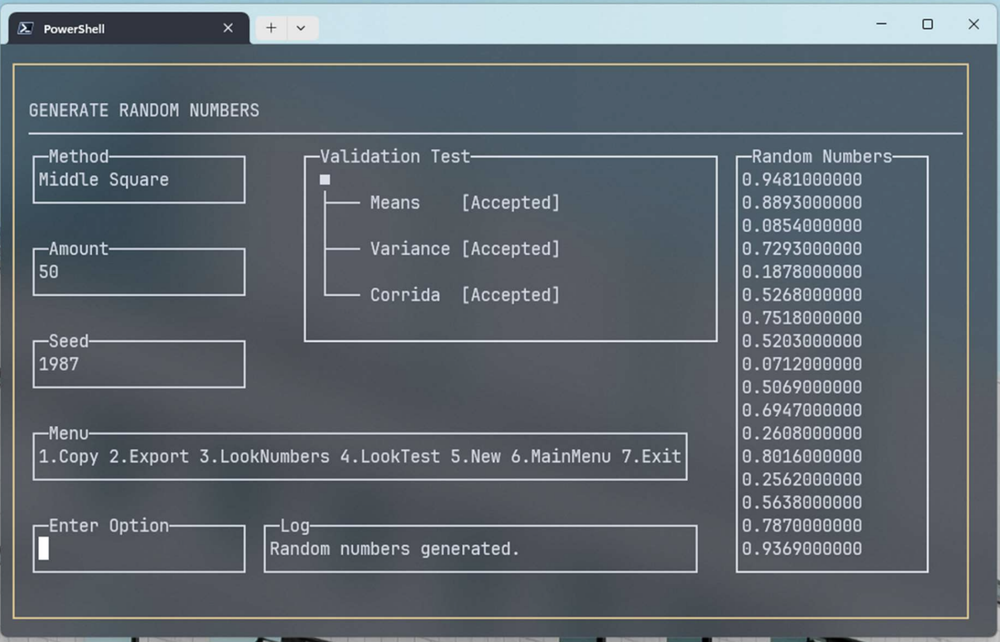

# Java PRNG Validator



Pseudorandom number generator and statistical validator built in Java. Generates numbers using three different methods and validates their quality through uniformity and independence tests. The entire interface runs on a custom console UI framework built from scratch using JLine.

## How It Works

The program operates in two modes:

**Generate** — Select a generation method, provide a seed and quantity, and the program generates pseudorandom numbers in the range [0, 1]. Results are immediately validated with statistical tests and displayed in the console UI. Numbers can be copied to clipboard or exported to a `.txt` file in your Downloads folder.

**Verify** — Paste numbers from external tools (Excel, RStudio, etc.) via clipboard. The program parses them and runs the same statistical validation tests, allowing you to evaluate pseudorandom sequences from any source.

### Generation Methods

- **Java Random** — Uses `java.util.Random` with a user-defined seed.
- **Lehmer LCG** — Linear congruential generator with multiplier 48271 and modulus 2³¹ − 1 (Mersenne prime). Produces the sequence sₖ₊₁ = (48271 · sₖ) mod (2³¹ − 1), normalized to [0, 1].
- **Middle Square** — Von Neumann's method. Squares the seed, extracts the middle 4 digits, and normalizes to [0, 1]. Repeats iteratively.

### Statistical Tests (α = 0.05)

- **Mean Test** (Uniformity) — Tests H₀: μ = 0.5 using a Z-interval. Calculates confidence bounds with the inverse standard normal distribution (NORMSINV).
- **Variance Test** (Uniformity) — Tests H₀: σ² = 1/12 using chi-square critical values. Bounds are computed with CHIINV at n − 1 degrees of freedom.
- **Runs Test** (Independence) — Counts directional runs in the sequence and compares the Z-statistic against Z_{α/2} to assess independence.

### Console UI Framework (`consoleui`)

The interface is a custom TUI (Text User Interface) framework built on top of JLine. It renders controls at absolute coordinates using ANSI escape sequences and manages input focus across components via dedicated threads. Available controls:

- **TextField** — Single-line text input with cursor management, backspace handling, and thread-based key reading.
- **ComboBox** — Navigable dropdown using W/A/S/D keys to cycle through options.
- **Label** — Static text with optional underline.
- **TextBlock** — Multiline text display with optional box border.
- **TextList** — Scrollable list with focus-based navigation.
- **Button** — Clickable control.
- **Rectangle** — Box-drawing shape using Unicode characters.

The framework also handles terminal resize detection and re-renders all components accordingly.

## Project Structure

```
├── src/
│   ├── App.java                          # Entry point and main loop
│   ├── Program.java                      # Menu screens and program logic
│   ├── numerics/
│   │   ├── RandomGenerator.java          # PRNG algorithms
│   │   └── RandomnessValidation.java     # Statistical tests
│   └── consoleui/
│       ├── controls/                     # TextField, ComboBox, Label, etc.
│       ├── containers/                   # Pane layout
│       ├── shapes/                       # Rectangle
│       └── utils/                        # ConsoleTerminal, Colors, KeyCodes
├── lib/                                  # External JARs
│   ├── apachecommonsmath/                # Apache Commons Math 3
│   ├── jline/                            # JLine 3 (terminal I/O)
│   └── jna/                              # JNA (native access for JLine)
└── bin/                                  # Compiled .class files
```

## Requirements

- Java 22+ (JDK)
- Libraries included in `lib/` (no external download needed)

## Build and Run

Compile:

```bash
javac -cp "lib/jna/jna.jar:lib/jna/jna-platform.jar:lib/jline/jline-console.jar:lib/jline/jline-reader.jar:lib/jline/jline-style.jar:lib/jline/jline-terminal-jansi.jar:lib/jline/jline-terminal-jna.jar:lib/jline/jline-terminal.jar:lib/jline/jline.jar:lib/apachecommonsmath/commons-math3.jar" -d bin -sourcepath src src/App.java
```

Run:

```bash
java -cp "bin:lib/jna/jna.jar:lib/jna/jna-platform.jar:lib/jline/jline-console.jar:lib/jline/jline-reader.jar:lib/jline/jline-style.jar:lib/jline/jline-terminal-jansi.jar:lib/jline/jline-terminal-jna.jar:lib/jline/jline-terminal.jar:lib/jline/jline.jar:lib/apachecommonsmath/commons-math3.jar" App
```

> **Note:** On Windows, replace `:` with `;` in the classpath separator.

## Libraries

- [Apache Commons Math 3](https://commons.apache.org/proper/commons-math/) — Inverse normal distribution (NORMSINV) and chi-square inverse (CHIINV) for statistical tests.
- [JLine 3](https://github.com/jline/jline3) — Terminal handling, raw mode input, and non-blocking key reading for the console UI.
- [JNA](https://github.com/java-native-access/jna) — Native platform access required by JLine for terminal integration.


---

*Originally developed on 19 September 2024.*
